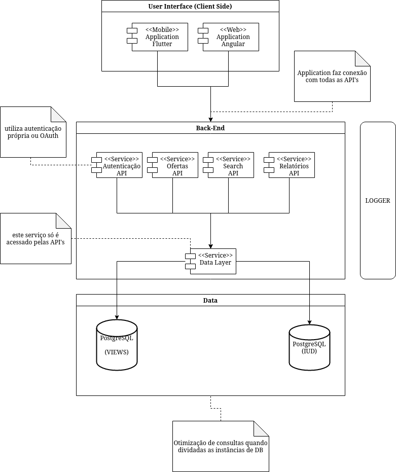

# iJobs

Marcio Vinicius de Souza da Rocha

## Requisitos não-funcioinais (Atributos de Qualidade) e Casos de Uso Críticos

* Segurança
  * Identificação de usuários para restrição de ações
    * Publicar Oferta (Uso Crítico)
    * Responder Oferta (Uso Crítico)
    * Autenticação de Usuário (Uso Crítico)
  * Obter informações dos candidatos, **uso restrito ao perfil "Usuário"** 
    * Consultar dados candidato (Uso Crítico)
  * Obter informações das estatísticas de operação, ofertas publicadas, respondidas, bloquear usuários, ativar usuários, **uso restrito ao perfil "Administrador"**
    * Consultar estatísticas de operação (Uso Crítico)
    * Bloquear Conta (Uso Crítico)
    * Ativar Conta (Uso Crítico) 
* Escalabilidade/Desempenho
  * Receber as requisições atendendo as necessidades dos administradores em relação à consulta das estatísticas de operação
    * Consultar estatísticcas de operações (Uso Crítico)
  * Envio de informações/avisos ao usuário que publicou a oferta
    * Processar Ofertas (Uso Crítico)
  * Dados do candidato devem estar disponíveis para o ofertador 
    * Consultar Oferta (Uso Crítico)
    * Consultar dados do usuário (Uso Crítico) 
* Confiabilidade
  * Após um deterinado tempo as ofertas serem publicadas as mesmas não poderão ser alteradas ou canceladas, esta e seu resultado devem ficar disponíveis
    * Publicar Oferta (Uso Crítico)
    * Cancelar Oferta (Uso Crítico)
    * Alterar Oferta (Uso Crítico)
    * Processar Oferta (Uso Crítico)
  * Aceitação ou renovação de uma oferta após o processamento
    * Conclusão de Oferta (Uso Crítico)
    * Renovação de Oferta (Uso Crítico)

## Arquitetura 

