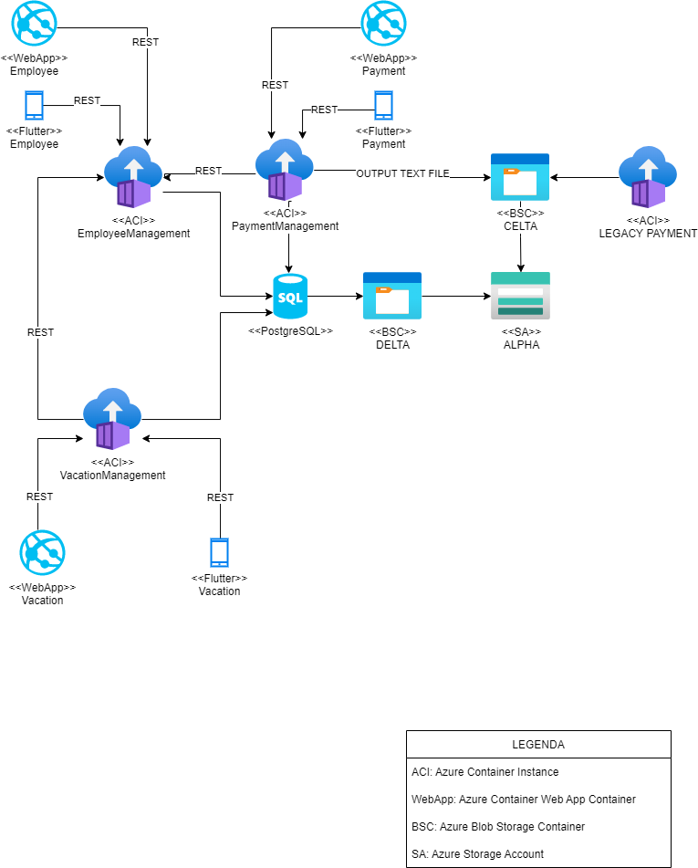

# YE Old RH

Aluno: Marcio Vinicius de Souza da Rocha

## Requisição

Desenvolver um sistema de RH que seja capaz de realizar:
* Gerenciamento de colaboradores
* Gerenciamento dos pedidos de aumento
* Gerenciamento de férias
* Integração com sistema legado de pagamento de salário

## Requisitos não funcionais

* Sistema deve funcionar offline
* Requisções por dia: 700 (CRUD)
* tamanho médio por usuario: 2Mb
* disponibilidade mínima: 99,5%
* Tamanho de arquivos digitalizados = 10mb

Especificação de Armazenamento:
* Tamanho do DB: 1000 * 2Mb = 2Gb (media por usuario)
* Tamanho do storage para arquivos: 1000*10=10Gb

_como será utilizado um Blob Storage Container, não é necessário se preocupar com armazenamento para "branch" de produção, pois neste componente é pago somente pelo consumo e não pelo tamanho fixo_

## Especificação dos componentes

* Arquitetura Micro-Serviço
* Azure Container Instance: Altamente escalável e possui elasticidade
* Web App: Deploy em Container para manter a padrozinação
* Todos os Serviços dos ACI's são em Java com Spring Framework
* Os WebApps são feitos em Angular 13
* Os Apps Mobile são desenvolvidos em Flutter

## Diagrama dos Componentes

